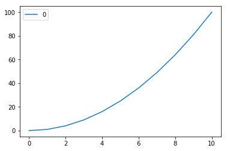

# Jupyter 'n Jekyll
> *Displaying your interactive sessions on a static blog*

A match made in Heaven? You can download your Jupyter Notebooks, as MARKDOWN, HTML, and ASCII. From there, making a page or post is easy!

```python
import pandas as pd
```


```python
import numpy as np
```


```python
import matplotlib.pyplot as plt
```


```python
x = [0,1,2,3,4,5,6,7,8,9,10]
y = []
for i in x:
    y.append(x[i]**2)
```


```python
parabola = pd.Series(y,x).to_frame()
```


```python
parabola
```


<div>
<style scoped>
    .dataframe tbody tr th:only-of-type {
        vertical-align: middle;
    }

    .dataframe tbody tr th {
        vertical-align: top;
    }

    .dataframe thead th {
        text-align: right;
    }
</style>
<table border="1" class="dataframe">
  <thead>
    <tr style="text-align: right;">
      <th></th>
      <th>0</th>
    </tr>
  </thead>
  <tbody>
    <tr>
      <th>0</th>
      <td>0</td>
    </tr>
    <tr>
      <th>1</th>
      <td>1</td>
    </tr>
    <tr>
      <th>2</th>
      <td>4</td>
    </tr>
    <tr>
      <th>3</th>
      <td>9</td>
    </tr>
    <tr>
      <th>4</th>
      <td>16</td>
    </tr>
    <tr>
      <th>5</th>
      <td>25</td>
    </tr>
    <tr>
      <th>6</th>
      <td>36</td>
    </tr>
    <tr>
      <th>7</th>
      <td>49</td>
    </tr>
    <tr>
      <th>8</th>
      <td>64</td>
    </tr>
    <tr>
      <th>9</th>
      <td>81</td>
    </tr>
    <tr>
      <th>10</th>
      <td>100</td>
    </tr>
  </tbody>
</table>
</div>


```python
parabola.describe()
```


<div>
<style scoped>
    .dataframe tbody tr th:only-of-type {
        vertical-align: middle;
    }

    .dataframe tbody tr th {
        vertical-align: top;
    }

    .dataframe thead th {
        text-align: right;
    }
</style>
<table border="1" class="dataframe">
  <thead>
    <tr style="text-align: right;">
      <th></th>
      <th>0</th>
    </tr>
  </thead>
  <tbody>
    <tr>
      <th>count</th>
      <td>11.000000</td>
    </tr>
    <tr>
      <th>mean</th>
      <td>35.000000</td>
    </tr>
    <tr>
      <th>std</th>
      <td>34.435447</td>
    </tr>
    <tr>
      <th>min</th>
      <td>0.000000</td>
    </tr>
    <tr>
      <th>25%</th>
      <td>6.500000</td>
    </tr>
    <tr>
      <th>50%</th>
      <td>25.000000</td>
    </tr>
    <tr>
      <th>75%</th>
      <td>56.500000</td>
    </tr>
    <tr>
      <th>max</th>
      <td>100.000000</td>
    </tr>
  </tbody>
</table>
</div>


```python
parabola.plot()
plt.savefig('/Users/andrewpuleo/Desktop/myplot.pdf')
```



